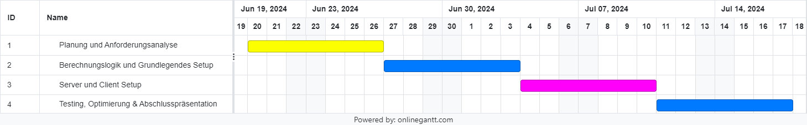

# Projekt 3

**Handelsplatz als RESTful-Webservice**

**Wilkommen beim Gemüse-Handelplatz!**

Nutzer*innen können Brokkoli, Zwiebeln, Knoblauch, Lauch, Blumenkohle, Karotten, Petersilien, Spinat, Kartoffeln und Tomaten.

Die Preise der Gemüse werden periodisch aktualisiert!

Viel Glück beim Kaufen und Verkaufen !! :)

**Anforderungsliste;**

**i) Webservice-Server (Backend)**

Berechnungslogik: Implementierung der kompletten Berechnungslogik in C++ für das synthetische Generieren von Handelswerten.

REST-API: Bereitstellung der Berechnungslogik von Handelswerten als REST-API mittels pybind11

Konto-Verwaltung: Erstellen, Löschen und Verwalten von Konten. Ein Konto enthält Informationen über Nutzer*innen wie Name, Authentifizierungsmethode (Kennwort), vorrätige Güter, Hauptwährung.

**ii) Client (Frontend)**

Client-Funktionalität: Implementierung des REST-Clients in Python. Benutzeroberfläche (GUI) zur Anzeige der Einloggen-Seite, Verkauf-, Kaufseite und Graph von aktuellen Handelswerten.

**iii) Dokumentation und Testing**

Dokumentation: Ausführliche Dokumentation des Codes und der API. Technische Dokumentation zur Systemarchitektur und den verwendeten Technologien.

Testing: Unit-Tests für die Berechnungslogik in C++. Integrationstests für die REST-API. End-to-End-Tests für die gesamte Anwendung (Server und Client).

**Zeitplan (Gantt Diagramm):**

geplanter Zeitplan:

resultierender Zeitplan (aktuell):

